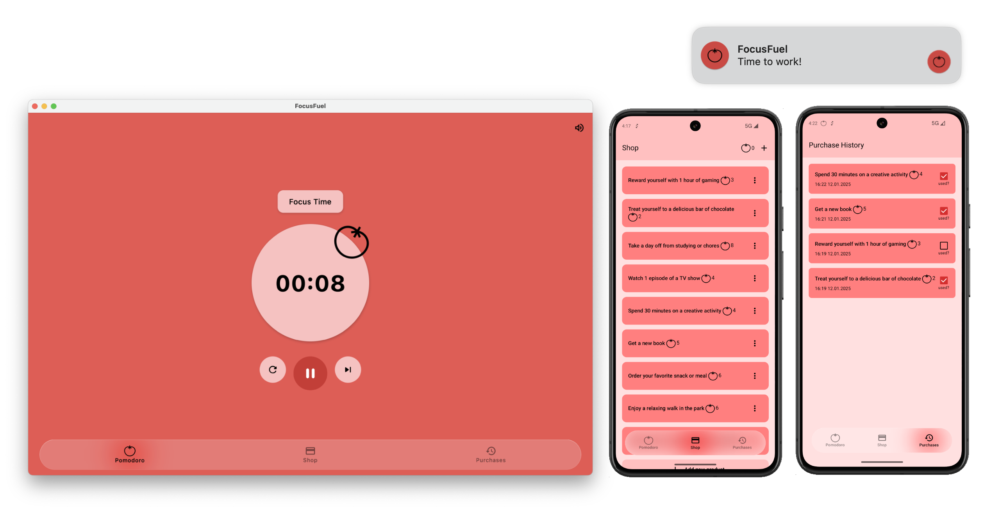

# FocusFuel

FocusFuel is a Pomodoro app designed to help you stay motivated and beat procrastination. With FocusFuel, you can collect completed Pomodoros and exchange them for rewards, creating a tangible incentive to stay focused on your work or studies.

This application has been developed for the **Kotlin Multiplatform Contest 2025**, showcasing the potential of Kotlin Multiplatform to build cross-platform applications with ease.

## Features
- **Reward System**: Add custom rewards and exchange your completed Pomodoros for them.
- **Purchase History**: Keep track of your redeemed rewards.
- **Reward Collection**: Mark whether you have collected a reward.
- **Cross-Platform**: Supports desktop and Android devices.

This app was created by a student who understands the challenges of staying productive and aims to make productivity more engaging.



---

## Running the App

### Desktop
- **Best Way**: Run the following command to package the app for your operating system:
  ```
  ./gradlew packageDistributionForCurrentOS
  ```
- **Quick Way**: Use this command to run the app directly:
  ```
  ./gradlew composeApp:run
  ```
  *Note*: Notifications may not work with this method.

### Android Emulator
1. Ensure you have an Android virtual device set up. If not, create one using Android Studio.
2. Select the `composeApp` run configuration from the list.
3. Choose your virtual device and click **Run**.

### Customizing Timer Length
To adjust the timer length for quicker testing or use, you can modify the duration in the `PomodoroTimer.kt` file. This allows you to collect Pomodoros faster without waiting for the full default timer duration.

### Notifications
The app requests permission to send notifications to enhance your experience. However, it remains fully functional even if notification permissions are not granted.

---

## Technical Details

### Architecture
FocusFuel leverages [Circuit by Slack](https://slackhq.github.io/circuit/) to implement the unidirectional data flow (UDF) design pattern. It also utilizes Circuit's built-in navigation for seamless user experience.

### Libraries Used
| Library                                                                                                                                   | Description                                          |
|-------------------------------------------------------------------------------------------------------------------------------------------|------------------------------------------------------|
| [JetBrains/compose-multiplatform](https://github.com/JetBrains/compose-multiplatform)                                                     | For building modern, responsive UIs across platforms |
| [russhwolf/multiplatform-settings](https://github.com/russhwolf/multiplatform-settings)                                                   | For saving key-value data                            |
| [mirzemehdi/KMPNotifier](https://github.com/mirzemehdi/KMPNotifier/)                                                                      | For sending notifications                            |
| [touchlab/Kermit](https://github.com/touchlab/Kermit)                                                                                     | Logging                                              |
| [evant/kotlin-inject](https://github.com/evant/kotlin-inject) and [amzn/kotlin-inject-anvil](https://github.com/amzn/kotlin-inject-anvil) | Dependency injection                                 |
| [androidx/room](https://developer.android.com/jetpack/androidx/releases/room)                                                             | Database management                                  |
| [chrisbanes/haze](https://github.com/chrisbanes/haze)                                                                                     | Semitransparent composables                          |
| [arrow-kt/arrow](https://github.com/arrow-kt/arrow)                                                                                       | Functional error handling                            |

---

## Contributing
If you have suggestions or find issues, feel free to submit an issue or a pull request. Let's make productivity rewarding together!

